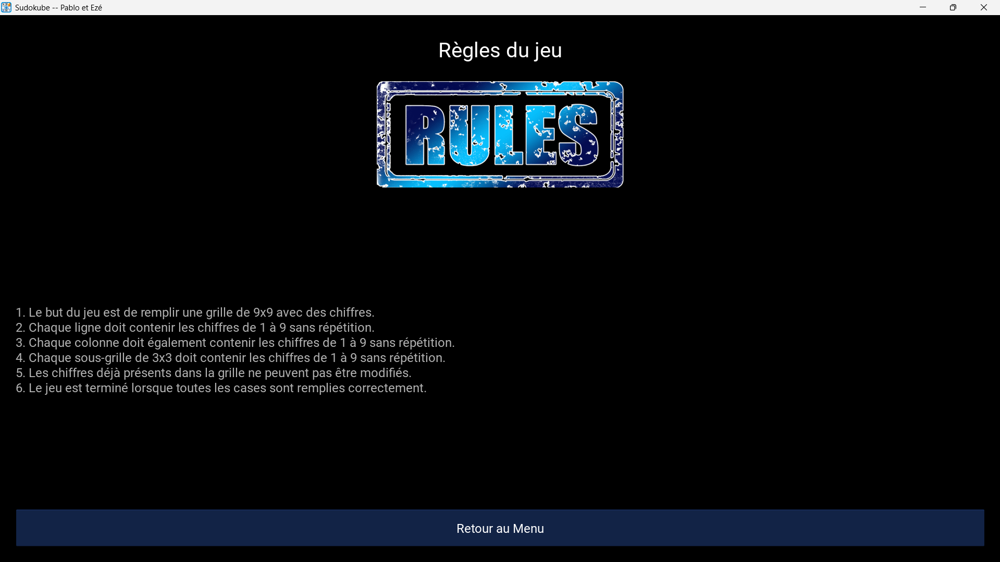
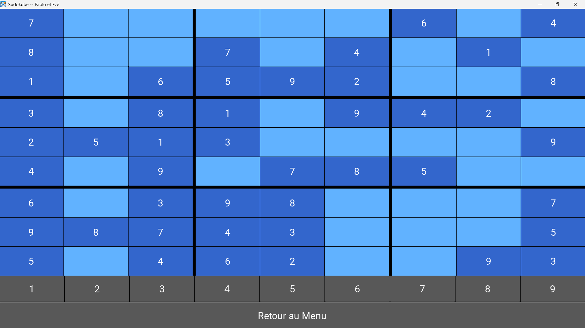

**Rapport sur l'application Sudoku**
**1. Nom du logiciel : Sudoku App**
Par : Pablo Faivre et Ezéchiel Renault


**2. Sommaire**
Introduction
Contexte des fonctions
Description des 10 fonctions principales
Bibliothèques et APIs utilisées
Jeux d'essai
Captures d'écran
Résumé des discussions techniques
Conclusion
Bibliographie


**3. Introduction**
L'application Sudoku est un jeu interactif qui permet aux utilisateurs de jouer à des grilles de Sudoku générées automatiquement. L'utilisateur peut choisir le niveau de difficulté, remplir la grille et valider sa solution. Le projet se compose d'un backend pour la logique du jeu et d'une interface utilisateur développée avec Kivy.


**4. Contexte des fonctions**
Voici une description des principales fonctions utilisées dans le projet :
Backend (Fichier backend.py)
generate(level)


Description : Génère une grille Sudoku avec un certain nombre de cases vides.
Arguments :
level (int) : Niveau de difficulté (nombre de cases vides).
Valeur de retour : None
is_valid(col, row, number, initial=False)


Description : Vérifie si un chiffre peut être placé dans une case.
Arguments :
col, row (int) : Coordonnées de la case.
number (int) : Chiffre à placer.
initial (bool) : Utiliser la grille initiale ?
Valeur de retour : bool
solve()


Description : Résout la grille en utilisant le backtracking.
Arguments : Aucun.
Valeur de retour : bool (True si la grille est résolue).
Interface utilisateur (Fichier main.py)
start_game(lvl)


Description : Initialise une partie en générant une grille selon le niveau choisi.
Arguments :
lvl (int) : Niveau de difficulté.
Valeur de retour : None
clickButton(value)


Description : Permet de remplir une case avec un chiffre donné par l'utilisateur.
Arguments :
value (Button) : Bouton sélectionné.
Valeur de retour : None
is_grid_full()


Description : Vérifie si la grille est complète.
Arguments : Aucun.
Valeur de retour : bool

**5. Bibliothèques et APIs utilisées**
1. random (Backend)
Fonctions utilisées : randint, shuffle, sample.
Utilité : Pour générer des nombres aléatoires et remplir les cases initiales de la grille.
2. Kivy (Interface utilisateur)
Fonctions utilisées :
GridLayout, BoxLayout, Button, Label, etc.
Gestion des écrans avec ScreenManager et transitions avec SlideTransition.
Utilité : Créer une interface utilisateur réactive et esthétique.


**6. Jeux d'essai**

1. Programme `backend.py` :  
   - Testez les fonctions principales de la classe `Grid`, comme `generate`, `is_valid`, `set_element`, `solve`, et `is_solved`.
   - Créez une suite de tests unitaires pour simuler différentes configurations de grille et vérifier le comportement des méthodes.

2. Programme `main.py` :
   - Testez l'intégration avec l'interface graphique en simulant des interactions avec les widgets.
   - Vérifiez si les boutons et les grilles fonctionnent correctement avec les données de `Grid` dans le backend. 

### Jeux d'essais pour `backend.py`
Voici un exemple de fichier de test :

```python
import unittest
from backend import Grid, Box

class TestGrid(unittest.TestCase):

    def setUp(self):
        self.grid = Grid()

    def test_generate(self):
        self.grid.generate(level=10)
        filled_cells = sum(1 for row in self.grid.grid for cell in row if cell.value != 0)
        self.assertGreaterEqual(filled_cells, 71, "La grille doit contenir au moins 71 cases remplies.")

    def test_is_valid(self):
        self.grid.grid[0][0] = Box(5)
        self.assertFalse(self.grid.is_valid(0, 0, 5), "Le chiffre ne doit pas être autorisé dans une case déjà remplie.")
        self.assertTrue(self.grid.is_valid(1, 0, 5), "Le chiffre devrait être valide dans une autre case.")

    def test_set_element(self):
        self.grid.generate(level=10)
        row, col = 0, 0
        self.grid.grid[row][col] = Box(0, locked=False)
        self.assertTrue(self.grid.set_element(col, row, 3), "La valeur devrait être définie correctement.")
        self.assertEqual(self.grid.grid[row][col].value, 3, "La case devrait contenir la valeur définie.")

    def test_solve(self):
        self.grid.generate(level=10)
        self.assertTrue(self.grid.solve(), "La grille générée devrait être résolvable.")

    def test_is_solved(self):
        self.grid.generate(level=0)  # Crée une grille complète
        self.assertTrue(self.grid.is_solved(), "La grille complète devrait être considérée comme résolue.")

if __name__ == '__main__':
    unittest.main()
```

### Jeux d'essais utilisé pour `projet_python_updated.py`
Pour tester l'interface graphique, on a simulé les interactions manuellement en exécutant l'application. Ces tests sont plus complexes et nécessitent des scénarios définis pour chaque interaction, comme :
- Cliquer sur une case pour la sélectionner.
- Entrer une valeur dans une cellule modifiable.
- Vérifier que les cellules se mettent à jour correctement après des changements dans `Grid`.


**7. Captures d'écran**
Écran principal avec les choix de difficulté.

Écran de regle

Exemple de grille

Écran de victoire


**8. Résumé des discussions techniques**
Problèmes rencontrés et solutions trouvées
Coloration multiple des cellules : Lors du clic sur une cellule, plusieurs étaient colorées. La solution consistait à remonter aux parents via la hiérarchie des widgets pour désactiver la mise en surbrillance des autres cellules.


Coordonnées incorrectes pour les grilles 3x3 : Les coordonnées des cellules sélectionnées ne correspondaient pas toujours à la grille 9x9. Après investigation, les calculs des indices ont été corrigés en utilisant la méthode set_grid_values et des impressions pour vérifier les indices.


Validation des boutons activables/désactivables : Implémentation de la fonction is_valid dans le backend pour tester chaque chiffre possible (1 à 9) pour une case donnée. La gestion des boutons activables a été intégrée dans clickButton et d'autres méthodes associées.


Accès aux valeurs précises des cellules : Correction de l'accès aux coordonnées via la hiérarchie de widgets et confirmation avec des tests.


Crashs liés à des modifications involontaires dans le backend : Des erreurs survenaient après des ajustements dans la logique du solveur. Un retour à une version stable a permis de corriger ces problèmes.


Gestion des sous-grilles : Les interactions entre les grilles 3x3 et les cellules nécessitaient une synchronisation correcte avec les coordonnées dans la grille principale.


Notes informelles
Décision de se concentrer sur les boutons activables pour une meilleure interaction utilisateur.
Proposition de futures améliorations comme un écran d'accueil plus élaboré ou la gestion d'états supplémentaires pour les cellules.
Utilisation d'une discussion collaborative pour partager les idées et les correctifs en temps réel.


**9. Conclusion**
Difficultés rencontrées
Gérer les interactions entre l'interface utilisateur et la logique backend.
Optimisation des performances du solveur.
Extensions possibles
Ajouter un mode chronométré.
Sauvegarde et reprise des parties en cours.

**10. Bibliographie**
Documentation Kivy : https://kivy.org/doc/stable/


